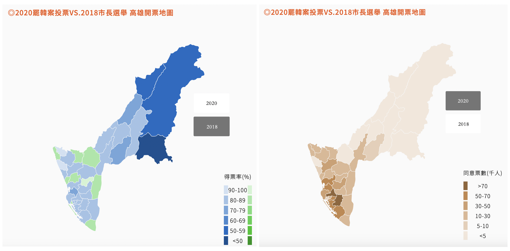
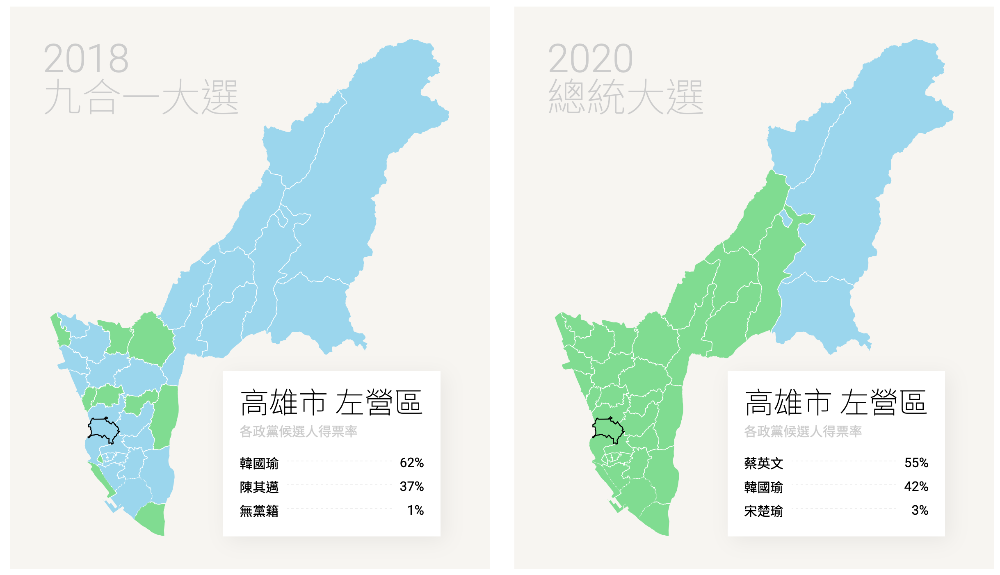
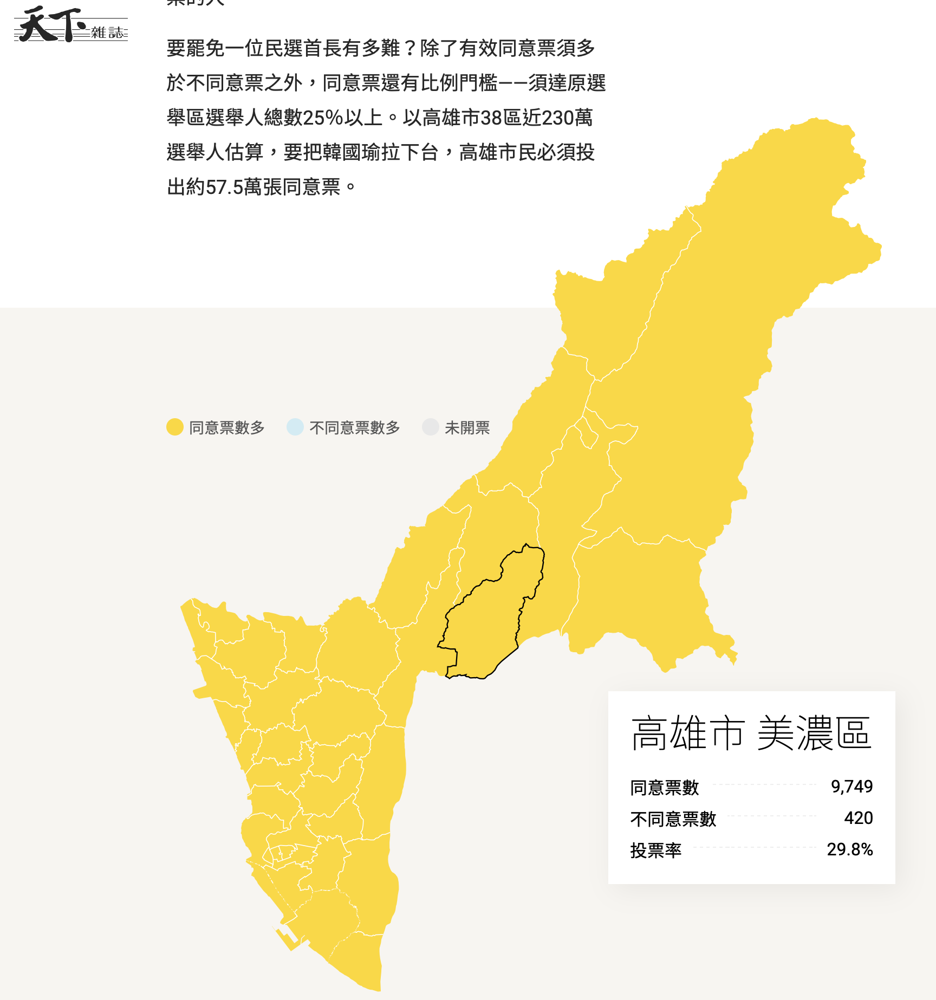

```{r setup, include=FALSE}
knitr::opts_chunk$set(echo = FALSE, message=FALSE, warning=FALSE, eval=TRUE)
```

```{r, comment='', echo=FALSE, message=FALSE, warning=FALSE}
options(shiny.usecairo = FALSE)
library(shiny)
library(dplyr)
library(ggplot2)
```

## Outline

### 1. 研究動機

### 2. 研究目的

### 3. 研究方法

### 4. 資料集與變項

### 5. 研究結果

### 6. 結論

<br/>

## 研究動機 (1/7)

- 2018年，參選高雄市市長的韓國瑜迅速竄紅

- 韓當選市長後亦繼續投入2020年的總統選戰，然而敗選

- 韓接著輸掉了台灣史上第一次的直轄市長罷免案

- 高雄選民在這三次投票對於韓的支持度有所消長，其變化值得探討

- 罷免案開票後，已有不少分析專題報導進行了資料視覺化，但都有可改善之處 

<script src="https://polyfill.io/v3/polyfill.min.js?features=es6"></script>
<script id="MathJax-script" async src="https://cdn.jsdelivr.net/npm/mathjax@3/es5/tex-mml-chtml.js"></script>

## 研究動機 (2/7) - 聯合新聞網

<div class="text-center">
  
</div>

## 研究動機 (3/7) - 聯合新聞網

- 市長選舉與總統選舉結果的視覺化，一個用票數，一個用得票率（也沒交代計算方式）

- 兩者都用同樣的指標來表示選民對韓的支持度可能比較恰當

## 研究動機 (4/7) - 天下雜誌

<div class="text-center">
  
</div>

## 研究動機 (5/7) - 天下雜誌

<div class="text-center">
  
</div>

##  研究動機 (6/7) - 天下雜誌

- 有細看各行政區罷免案結果的互動式介面，使用者游標滑到某一行政區時可呈現該行政區的結果。

- 市長選舉與總統選舉結果的比較也是互動式介面，但如果沒有文字，就圖而言只能明顯看到「藍綠轉換」，無法明顯看到「**高雄選民對韓國瑜支持度的變化**」。
    
## 研究動機 (7/7)

- 針對2018年台灣多個公投案的分析（廖傑恩 et al.，2019）
    
    - 地緣接近或可能有類似人口學特徵的縣市，在公投投票行為上有類似的結構
    - e.g.,花蓮縣與台東縣在各個公投案的同意率接近

- 本研究欲探討高雄市內各個行政區在這三次的投票中，對韓支持度是否也具有地緣關聯

- 也欲探討高雄市各行政區人口學指標與三次投票的結果是否有所關聯

## 研究目的 {.smaller}

### 1. 以資料視覺化呈現高雄市各行政區三次投票的結果，特別是要呈現出變化

### 2. 探討地緣接近的高雄市行政區在三次投票中是否有類似的結果

### 3. 探討高雄市各行政區人口學指標與三次選舉結果之關聯

## 資料集與變項 (1/3)

- 台灣鄉鎮市區地圖資料（僅使用高雄市資料）

- 中選會2018年直轄市長選舉案各行政區投票[結果](https://db.cec.gov.tw/histMain.jsp?voteSel=20181101C1)（僅使用高雄市資料）

- 中選會2020年中華民國總統選舉案各行政區投票[結果](https://db.cec.gov.tw/histMain.jsp?voteSel=20200101A1)（僅使用高雄市資料）

- 中選會2020年高雄市長罷免案各行政區投票[結果](https://www.cec.gov.tw/khec/cms/latestNews/33405)
  
- 高雄市各行政區人口學指標

    - 高雄市政府民政局-本市各區里戶口數月[統計](https://cabu.kcg.gov.tw/Stat/StatRpts/StatRpt1.aspx)
    - 高雄市政府民政局-高雄市年終靜態人口統計[報表](https://cabu.kcg.gov.tw/Web/StatRptsFileList.aspx?catid=77b7174e-f379-49ec-b2fd-2b42abf650ca&p=8)
    - 高雄市政府住宅生活網-密度分佈[統計表](https://housing.kcg.gov.tw/LFA/LFA03/LFA03007004.jsp)

## 資料集與變項 (2/3)

### 依變項

1. 市長選舉韓國瑜得票率（市長選舉中，韓得票數／所有候選人總得票數）

2. 總統選舉韓國瑜得票率（總統選舉中，韓得票數／所有候選人總得票數）

3. 罷免案韓國瑜支持度（1 - 同意罷免票數／$N_{adj}$ ）
  
    - $N_{adj}$ = (市長選舉所有候選人總得票數 + 總統選舉所有候選人總得票數 ) / 2
    
    - Assumptions:
    
        1. 在這三次投票中，具有支持韓與否意志的選民數量接近
        2. 前兩次選舉中，沒出來投票的選民視為沒有支持意志
        3. 前兩次選舉有去投，但沒去投罷免案的選民，視為支持韓國瑜

## 資料集與變項 (3/3)

### 獨變項

- 資料以行政區為單位紀錄

- 取投票時間前一個月（i.e., _2018/10_, _2019/12_, _2020/05_）或近年度（i.e., _2018_, _2019_）的資料

- 納入考慮的人口學變項：性別、年齡、教育程度、人口密度、人口社會增加率、人口自然增加率、家戶密度等

## 研究方法 {.smaller}

本研究使用R程式語言進行資料管理與資料分析。

1. *資料基本探索*：使用基本統計與視覺化方法初步探索資料

2. **資料視覺化**：使用`sf`、`leaflet`、`leafem`、`mapview`等R套件繪製高雄市行政區圖，在行政區圖中填上有深淺差異的顏色來表示這三次投票結果與其變化。

```{r, comment='', echo=TRUE, message=FALSE, warning=FALSE}
library(sf)       # 讀進地圖資料檔
library(leaflet)  # 繪製地圖
library(leafem)   # 繪製地圖
library(mapview)  # 呈現互動式地圖
```

2. **群聚分析（cluster analysis）**：針對三次投票的結果做群聚分析，看各個行政區在投票行為上是否與地緣有關，如果有關的話，地緣接近的行政區在進行群聚分析後，會被分在同組或接近的組。

3. **正則化迴歸分析**：使用正則化迴歸方法找出與三次投票結果有關聯的人口學變項
    
    - 納入的獨變項數量多於資料筆數（i.e., 60 _vs_ 38），使用脊與套索迴歸（ridge and lasso regression）。

## 研究結果

- 資料基本探索

- 研究目的一：以地圖呈現三次投票結果及其變化

- 研究目的二：群聚分析（投票與地緣結構）

- 研究目的三：正則化迴歸分析（投票與人口學指標）

```{r, comment='', echo=FALSE, message=FALSE, warning=FALSE}
# (Load in the packages)
library(readxl)
library(dplyr)
```

```{r, comment='', echo=FALSE, message=FALSE, warning=FALSE}
# (Load in the non-map data sets)

## Mayor 2018
mayor <- read_xls('./data/Mayor_2018_KH.xls', range = 'A6:O1866', col_names = FALSE)
colnames(mayor) <- c('TOWNNAME', 'village', 'vote_venue',
                     'Han', 'candidate2', 'candidate3', 'candidate4',
                     'valid', 'invalid', 'vote_counts',
                     'voteD', 'voteE', 'voteF', 'voter_counts', 'vote_rate')
mayor$TOWNNAME <- substr(mayor$TOWNNAME, 2, 4)
mayor_use <- mayor %>% dplyr::filter(is.na(village)) %>% 
  dplyr::select(TOWNNAME, Han, valid, vote_counts, voter_counts, vote_rate) %>%
  mutate(vote_rate2 = vote_counts / voter_counts, Han_rate = Han / valid)

## President 2020
president <- read_xls('./data/President_2020_KH.xls', range = 'A7:L44', col_names = FALSE)
colnames(president) <- c('TOWNNAME', 'candidate1', 'Han', 'candidate3',
                         'valid', 'invalid', 'vote_counts', 'voteD', 'voteE',
                         'voteF', 'voter_counts', 'vote_rate')
president$TOWNNAME <- substr(president$TOWNNAME, 2, 4)
president_use <- president %>%
  dplyr::select(TOWNNAME, Han, valid, vote_counts, voter_counts, vote_rate) %>%
  mutate(vote_rate2 = vote_counts / voter_counts, Han_rate = Han / valid)

## Mayor recall 2020
recalll <- read_xlsx('./data/Mayor_recall_2020_KH.xlsx', range = 'A7:K44', col_names = FALSE)
colnames(recalll) <- c('TOWNNAME', 'agree', 'disagree', 'valid', 'invalid',
                       'vote_counts', 'voteF', 'voteG', 'voteH',
                       'voter_counts', 'vote_rate')
recalll$TOWNNAME[recalll$TOWNNAME == '那瑪夏區'] <- '那瑪夏'
recalll_use <- recalll %>%
  dplyr::select(TOWNNAME, agree, disagree, valid,
                vote_counts, voter_counts, vote_rate) %>%
  mutate(vote_rate2 = vote_counts / voter_counts,
         Han_rate1 = 1 - agree / valid,
         Han_rate2 = 1 - agree / voter_counts)
```

```{r, comment='', echo=FALSE, message=FALSE, warning=FALSE}
# (Merge three non-map data sets)
dta <- mayor_use %>%
  inner_join(y = president_use, by = 'TOWNNAME', suffix = c('.mayor', '.president')) %>%
  inner_join(x = ., y = recalll_use, by = 'TOWNNAME', suffix = c('', '.recall')) %>% 
  mutate(Han_rate.recall = 1 - agree / ((vote_counts.mayor + vote_counts.president)/2))
colnames(dta)[16:24] <- paste0(colnames(dta)[16:24], '.recall')
```

<br/>
<br/>
<br/>
<br/>
<br/>
<br/>
<br/>
<br/>
<br/>
<br/>
<br/>
<br/>
<br/>
<br/>

```{r, comment='', echo=FALSE, message=FALSE, warning=FALSE}
# (Load in the map data and merge it with the non-map data sets)

twn_map2 <- st_read('./data/mapdata202003270418/TOWN_MOI_1090324.shp')
kh_map2 <- twn_map2[twn_map2$COUNTYNAME == "高雄市",]

dta_voter_long <- dta %>%
  dplyr::select(TOWNNAME, 
                voter_counts.mayor,
                voter_counts.president, 
                voter_counts.recall) %>%
  reshape2::melt(id = 'TOWNNAME')
dta$TOWNNAME[dta$TOWNNAME == '那瑪夏'] <- '那瑪夏區'

df <- kh_map2 %>% dplyr::select(TOWNNAME, geometry) %>% left_join(dta)
rownames(df) <- df$TOWNNAME
df2 <- df
```

## 資料基本探索（三次投票密度圖）

```{r, comment='', echo=FALSE, message=FALSE, warning=FALSE}
mapview_loc <- c(mean(c(120.3593, 121.049)), mean(c(22.37135, 23.47171)))
```

```{r, comment='', echo=FALSE, message=FALSE, warning=FALSE}
# ui

sidebarLayout(
  sidebarPanel(
    tags$style(type = 'text/css',
               ".selectize-input { font-size: 18px; line-height: 18px;} .selectize-dropdown { font-size: 20px; line-height: 20px; }"),
    selectInput("vote_time", "要看哪次投票？",
                choices = c('市長選舉', '總統選舉', '市長罷免'), selected = '市長選舉'),
    selectInput("vote_index", "要看哪個指標？",
                choices = c('韓支持度', '投票率'), selected = '韓支持度'),
    width = 3
  ),
  mainPanel(
    plotOutput('disPlot_vote')
  )
)


# server

f_vote_time <- function(x, type) {
  if (type) {
    if (x == '市長選舉') {out <- '.mayor'}
    else if (x == '總統選舉') {out <- '.president'}
    else if (x == '市長罷免') {out <- '.recall'}
  } else {
    if (x == '市長選舉') {out <- '107/10'}
    else if (x == '總統選舉') {out <- '108/12'}
    else if (x == '市長罷免') {out <- '109/05'}
  }
  return(out)
} 

f_vote_index <- function(x) {
  if (x == '韓支持度' | x == '韓國瑜支持度') {out <- 'Han_rate'}
  else if (x == '投票率') {out <- 'vote_rate2'}
  return(out)
}

f_y_vote <- function(v, type=TRUE) {
  y_vote <- paste0(f_vote_index(v[2]), f_vote_time(v[1], type=type))
  return(y_vote)
}

output$disPlot_vote <- renderPlot({
  v <- c(input$vote_time, input$vote_index)
  y_vote_name <- f_y_vote(v)
  y_vote <- as.vector(dta[,y_vote_name])*100
  qplot(y_vote[,1], geom = 'density', xlim = c(0, 100),
        main = paste0(v[1], '中', v[2], '在高雄市各行政區分布密度圖'),
        xlab = paste0(v[2], ' (%)')) +
    theme_bw()
})
```

## 以地圖呈現三次投票結果（市長選舉）

```{r, comment='', echo=FALSE, message=FALSE, warning=FALSE, eval=TRUE}
m <- mapView(df['Han_rate.mayor'], map.type = 'CartoDB.Positron',
             layer.name = '韓得票率',
             col.regions = c('springgreen1', 'white', blues9)) %>%
  leafem::addStaticLabels(label = df$TOWNNAME)
m %>% setView(mapview_loc[1], mapview_loc[2], zoom = 9)
```

## 以地圖呈現三次投票結果（總統選舉）

```{r, comment='', echo=FALSE, message=FALSE, warning=FALSE}
m <- mapview(df['Han_rate.president'],#, map.type = 'CartoDB.Positron',
             layer.name = '韓得票率',
             col.regions = c('aquamarine4', paste0('springgreen', 4:1), 'white', blues9[2:8])) %>%
  leafem::addStaticLabels(label = df$TOWNNAME)
m %>% setView(mapview_loc[1], mapview_loc[2], zoom = 9)
```

## 以地圖呈現三次投票結果（市長罷免）

```{r, comment='', echo=FALSE, message=FALSE, warning=FALSE}
m <- mapview(df['Han_rate.recall'], map.type = 'CartoDB.Positron',
             layer.name = '韓支持度（反對罷免）',
             col.regions = c(paste0('deeppink', 3:1), 'white', blues9)) %>%
  leafem::addStaticLabels(label = df$TOWNNAME)
m %>% setView(mapview_loc[1], mapview_loc[2], zoom = 9)
```

```{r, comment='', echo=FALSE, message=FALSE, warning=FALSE}
#- 使用`standardize{robustHD}`將韓支持度與投票率標準化以利比較
library(robustHD)
df <- df %>% mutate(
  Han_rate.mayor.std = standardize(Han_rate.mayor),
  vote_rate2.mayor.std = standardize(vote_rate2.mayor),
  Han_rate.president.std = standardize(Han_rate.president),
  vote_rate2.president.std = standardize(vote_rate2.president),
  Han_rate.recall.std = standardize(Han_rate.recall),
  vote_rate2.recall.std = standardize(vote_rate2.recall),
  Han_rate.mayor.president = Han_rate.president.std - Han_rate.mayor.std,
  Han_rate.mayor.recall = Han_rate.recall.std - Han_rate.mayor.std,
  Han_rate.president.recall = Han_rate.recall.std - Han_rate.president.std,
  vote_rate2.mayor.president = vote_rate2.president.std - vote_rate2.mayor.std,
  vote_rate2.mayor.recall = vote_rate2.recall.std - vote_rate2.mayor.std,
  vote_rate2.president.recall = vote_rate2.recall.std - vote_rate2.president.std)
```

## 將三次投票中韓的支持度標準化，分層疊在地圖上

```{r, comment='', echo=FALSE, message=FALSE, warning=FALSE}
df_three <- df %>%
  dplyr::select(Han_rate.mayor.std, 
                Han_rate.president.std, Han_rate.recall.std)
colnames(df_three) <- c('市長選舉', '總統選舉', '市長罷免', 'geometry')
rownames(df_three) <- df$TOWNNAME
m <- mapview(list(df_three['市長選舉'],
                  df_three['總統選舉'],
                  df_three['市長罷免']),
             layer.name = paste0(c('市長選舉', '總統選舉', '市長罷免'), 
                                 '韓支持度'),
             col.regions = 
               paste0('grey', round(seq(100, 0, length.out = 10)))) %>%
  leafem::addStaticLabels(label = df$TOWNNAME)
m %>% setView(mapview_loc[1], mapview_loc[2], zoom = 9)
```

## 2018市長選舉與2020總統選舉韓國瑜支持度變化 {.smaller}

- 韓支持度 = 韓得票 / 所有候選人得票總數（有效票總數）

```{r, comment='', echo=FALSE, message=FALSE, warning=FALSE}
df <- df %>% mutate(市長與總統選舉差異 = Han_rate.president - Han_rate.mayor)

m <- mapview(df['市長與總統選舉差異'], map.type = 'CartoDB.Positron',
             layer.name = '韓支持度差',
             col.regions = rev(RColorBrewer::brewer.pal(9, 'Reds'))) %>%
  leafem::addStaticLabels(label = df$TOWNNAME)
m %>% setView(mapview_loc[1], mapview_loc[2], zoom = 9)
```

## 三次投票結果與變化

```{r, comment='', echo=FALSE, message=FALSE, warning=FALSE}
# ui

sidebarLayout(
  sidebarPanel(
    tags$style(type = 'text/css',
               ".selectize-input { font-size: 18px; line-height: 18px;} .selectize-dropdown { font-size: 20px; line-height: 20px; }"),
    selectInput("vote_index2", "要看哪個指標？",
                choices = list('韓支持度', '投票率'), selected = '韓支持度'),
    selectInput("vote_time21", "要看哪次投票結果？",
                choices = c('市長選舉', '總統選舉', '市長罷免'),
                selected = '市長選舉'),
    selectInput("vote_time22", "要和哪次投票結果比較？",
                choices = c('無', '市長選舉', '總統選舉', '市長罷免'),
                selected = '總統選舉'),
    width = 3
  ),
  mainPanel(
    tags$style(type='text/css', ".nav-tabs {font-size: 18px}"),    
    tabsetPanel(
      position = "above", type = 'pills',
      tabPanel('投票結果', leafletOutput('map')),
      tabPanel('兩次投票結果比較', leafletOutput('map_diff'))
    )
  )
)


# server

output$map <- renderLeaflet({
  v <- c(input$vote_time21, input$vote_index2)
  y_vote_name <- paste0(f_y_vote(v))
  m <- mapview(df[y_vote_name],
               layer.name = paste0(v[2]),
               col.regions = paste0('grey',
                                    round(seq(100, 0, length.out = 10)))) %>%
    leafem::addStaticLabels(label = df$TOWNNAME)
  m %>% setView(mapview_loc[1], mapview_loc[2], zoom = 9)
})

output$map_diff <- renderLeaflet({
  if (input$vote_time22 != '無') {
    vv <- c(input$vote_time21, input$vote_time22, input$vote_index2)
    if ((vv[1] == '市長選舉' & vv[2] == '總統選舉') | (vv[2] == '市長選舉' & vv[1] == '總統選舉')) {
      cols <- c('firebrick4', 'firebrick', paste0('firebrick', 3:1), 'deeppink')
    }
    else if ((vv[1] == '市長選舉' & vv[2] == '市長罷免') | ((vv[2] == '市長選舉' & vv[1] == '市長罷免'))) {
      cols <- c(paste0('firebrick', 4:1), 'white', paste0('dodgerblue', 1:3))
    }
    else if ((vv[1] == '總統選舉' & vv[2] == '市長罷免') | (vv[2] == '總統選舉' & vv[1] == '市長罷免')) {
      cols <- paste0('dodgerblue', 1:4)
    }
    else {cols <- 'grey50'}
    y_vote_name1 <- f_y_vote(vv[c(1,3)])
    y_vote_name2 <- f_y_vote(vv[2:3])
    df$D <- as.data.frame(df[,y_vote_name2])[,1]- as.data.frame(df[,y_vote_name1])[,1]
    m <- mapview(df['D'],
                 layer.name = paste0(vv[3], '差異'),
                 col.regions = cols) %>%
      leafem::addStaticLabels(label = df$TOWNNAME)
    m %>% setView(mapview_loc[1], mapview_loc[2], zoom = 9)
  }
})
```

## 研究目的二的分析方法：群聚分析{.smaller}

- 一種精簡資料的方法，依據樣本之間的共同屬性，將比較相似的樣本聚集在一起，形成**集群(cluster)**

- 通常以**距離**（值的差異）分類，相對距離愈近，相似程度愈高，使群內差異小、群間差異大。

    - 歐式距離（Euclidean）
    - 曼哈頓距離（Manhattan）
    - 坎培拉距離（Canberra
    - ...
    

- 階層式（Hierarchical）群聚分析法中常用的凝聚分層方式（agglomerative method）：
    
    - 單一聯結法（Single Linkage）
    - 完全連結法（Complete Linkage）
    - 平均法（Average Linkage）
    - 中心法（Centroid Method）
    - 華德最小變異法（Wards Method）

## 群聚分析分組結果示意圖

以歐式距離為分類依據，採用華德最小變異法進行階層式群聚分析

```{r, comment='', echo=FALSE, message=FALSE, warning=FALSE, fig.width=9}
set.seed(1234)
df_cluster <- dta %>%
  dplyr::select(Han_rate.mayor, Han_rate.president, Han_rate.recall) %>%
  as.data.frame()
rownames(df_cluster) <- dta$TOWNNAME
E.dist <- dist(df_cluster, method = "euclidean") # the distance measure to be used. This must be one of "euclidean", "maximum", "manhattan", "canberra", "binary" or "minkowski". Any unambiguous substring can be given.
h.cluster <- hclust(E.dist, method = "ward.D") # the agglomeration method to be used. This should be (an unambiguous abbreviation of) one of "ward.D", "ward.D2", "single", "complete", "average" (= UPGMA), "mcquitty" (= WPGMA), "median" (= WPGMC) or "centroid" (= UPGMC).

par(oma = c(1, 1.5, 1, 1.5))  # close the outer margins
par(mar = c(1, 1, 1, 1))  # close the inner margins
plot(h.cluster, xlab = '高雄市行政區',
     main = '以高雄市2018-2020年三次投票韓國瑜支持度對行政區群聚分析之結果')
```

## 群聚分析分組地圖

```{r, comment='', echo=FALSE, message=FALSE, warning=FALSE}
out_df_cluster <- data.frame(
  TOWNNAME = c('那瑪夏區', '桃源區', '茂林區', '前鎮區', '鳥松區',
               '三民區', '小港區', '燕巢區', '路竹區', '大寮區',
               '橋頭區', '阿蓮區', '林園區', '梓官區', '旗津區',
               '田寮區', '仁武區', '湖內區', '大社區', '鹽埕區',
               '永安區', '茄萣區', '大樹區', '六龜區', '內門區',
               '甲仙區', '杉林區', '美濃區', '旗山區', '彌陀區',
               '左營區', '前金區', '新興區', '岡山區', '苓雅區',
               '鼓山區', '楠梓區', '鳳山區'),
  plt_order = h.cluster$order,
  group = c(rep(1, 3), rep(2, 7), rep(3, 5),
            rep(4, 8), rep(5, 5), rep(6, 10))
)

df_cluster_map <- kh_map2 %>% dplyr::select(TOWNNAME, geometry) %>%
  left_join(out_df_cluster, by = 'TOWNNAME')
rownames(df_cluster_map) <- df_cluster_map$TOWNNAME

m <- mapView(x = df_cluster_map['group'], layer.name = '組別') %>%
  leafem::addStaticLabels(label = df_cluster_map$TOWNNAME)
m %>% setView(mapview_loc[1], mapview_loc[2], zoom = 9)
```

## 投票行為上與地緣有關

- 研究目的二發現：各個行政區在投票行為上與地緣有關，某些地緣接近的行政區在進行群聚分析後，會被分在同組或接近的組。

- 研究目的三：找出與三次投票結果有關聯的人口學變項

## 針對研究目的三的分析方法：正則化迴歸分析

- 真實資料可能難以符合線性迴歸的假設（e.g., 獨變項間不具共線性）

- 可能需要納入模型的獨變項數量大於樣本大小（i.e., $p > n$），而納入不具解釋力的獨變項上升，會使 $R^2$ 上升，卻沒反應模型解釋力

- 以正規化迴歸（regularized regression）對迴歸係數管控

    - 線性迴歸：$minimize[SS_E]$ ($SS_E$: Error sum of squares)

    - 正規化迴歸：$minimize[SS_E+P]$ ($P$: 懲罰項（penalty term）)

- 常見的懲罰項有兩種，分別對應到脊（ridge）與套索（lasso）迴歸

## 針對研究目的三的分析方法：脊與套索迴歸{.smaller}

- 脊（Ridge）迴歸：$minimize[SS_E+\lambda \sum_{j=1}^P \beta_j^2]，可降低資料雜訊

- 套索（Lasso）迴歸：$minimize[SS_E+\lambda \sum_{j=1}^P | \beta_j |]$，可避免不具解釋力的變項被納入（變數挑選）

- $\lambda$為超參數，人為調整或以交叉驗證法挑選

- 結合ridge and lasso：Elastic Net

$$minimize[SS_E + (1 - \alpha)\lambda \sum_{j=1}^P \beta_j^2 + \alpha \lambda \sum_{j=1}^P | \beta_j |]$$

- 在Ridge和Lasso模型中，要調整$\lambda$，而在Elastic net模型要調 $\lambda$ 與 $\  alpha$。

- 使用`glmnet`套件實作

```{r, comment='', echo=TRUE, message=FALSE, warning=FALSE}
library(glmnet)
```

## 獨變項：人口學變項

```{r, comment='', echo=FALSE, message=FALSE, warning=FALSE, eval=TRUE}
#### Elastic Net

# Load in the data sets
fls <- list.files(path = "./data/demography")
fL <- paste0("./data/demography/", fls)
demo_lst <- lapply(fL, read_xlsx)
names(demo_lst) <- gsub(fls, pattern = '.xlsx', replacement = '')

# Deal with pop_density
pop_long <- demo_lst$pop_density %>% reshape2::melt() %>%
  mutate(Year = as.numeric(substr(variable, 6, 8)), variable = substr(variable, 1, 4))
pop_final <- inner_join(pop_long[pop_long$variable == '人口密度',] %>% dplyr::select(-variable),
                        pop_long[pop_long$variable == '家戶密度',] %>% dplyr::select(-variable),
                        by = c("TOWNNAME", "Year"))
pop_final$Year[pop_final$Year == 107] <- '107/10'
pop_final$Year[pop_final$Year == 108] <- '108/12'
pop_final$Year[pop_final$Year == 109] <- '109/05'
colnames(pop_final)[2:4] <- c('人口密度', 'Month', '家戶密度')

# Deal with edu
edu <- demo_lst$edu %>% 
  dplyr::filter(TOWNNAME != '總計' & TOWNNAME != '總  計' & `年　齡　別` == '總計' & `性　別` == '計') %>%
  dplyr::select(-c(`年　齡　別`, `性　別`))
edu_sub1 <- edu %>% dplyr::filter(substr(TOWNNAME, 1, 2) == '鳳山') %>%
  group_by(Month) %>% summarise_if(is.numeric, sum) %>% mutate(TOWNNAME = '鳳山區')
edu_sub2 <- edu %>% dplyr::filter(substr(TOWNNAME, 1, 2) == '三民') %>%
  group_by(Month) %>% summarise_if(is.numeric, sum) %>% mutate(TOWNNAME = '三民區')
edu <- rbind(edu %>% 
               dplyr::filter(!(substr(TOWNNAME, 3, 3) %in% c('一', '二'))),
             edu_sub1, edu_sub2)  

# Join all data sets
dta_demo <- demo_lst$age %>% dplyr::filter(TOWNNAME != '高雄市' & 性別 == '總計') %>% dplyr::select(-性別) %>%
  inner_join(., demo_lst$data_management_population %>% dplyr::filter(TOWNNAME != '高雄市'), by = c('TOWNNAME', 'Month')) %>%
  inner_join(., demo_lst$natural_social_rate_of_increase %>% dplyr::filter(TOWNNAME != '高雄市'), by = c('TOWNNAME', 'Month')) %>%
  inner_join(., pop_final %>% dplyr::filter(TOWNNAME != '高雄市'), by = c('TOWNNAME', 'Month')) %>%
  inner_join(., edu, by = c('TOWNNAME', 'Month'))

# Transform to proportion
dta_demo <- dta_demo %>% dplyr::select(-c('總計', '總　計', '人口數', 'POP', '里數', '鄰數', '戶數', '人口密度', '家戶密度')) %>%
  mutate_if(is.numeric, function(v) {v / dta_demo$POP * 100}) %>%
  inner_join(., dta_demo %>% dplyr::select(TOWNNAME, Month, 里數, 鄰數, 戶數, 人口密度, 家戶密度), by = c('TOWNNAME', 'Month')) %>%
  mutate(性別比 = 男 / 女 * 100)

# Modify the column names
colnames(dta_demo)[2:22] <- paste0('年齡', colnames(dta_demo)[2:22], '人口比例')
colnames(dta_demo)[33:55] <- paste0(c('識字者', '博士畢業', '博士肄業', '碩士畢業', '碩士肄業', '大學畢業', '大學肄業',
                                      '二三年制專科畢業', '二三年制專科肄業', '五專後二年畢業', '五專後二年肄業',
                                      '高中畢業', '高中肄業', '高職畢業', '高職肄業', '五專前三年肄業',
                                      '國中畢業', '國中肄業', '初職畢業', '初職肄業', '國小畢業', '國小肄業', '自修'), '比例')
colnames(dta_demo)[26:32] <- c('出生率', '死亡率', '自然增加率', '移入率', '移出率', '社會增加率', '人口增加率')

# Show the IV names
IV_names <- dta_demo %>% dplyr::select(-c(TOWNNAME, Month)) %>% colnames()
set.seed(1234)
sample(IV_names, 24) %>% matrix(., 6, 4) %>% knitr::kable()
```

```{r, comment='', echo=FALSE, message=FALSE, warning=FALSE}
cv_alpha <- function(idx = c('107/10', '.mayor'), l=100) {
  dta_demo_elastic <- dta_demo %>%
    dplyr::filter(Month == idx[1]) %>%
    inner_join(dta %>% dplyr::select(TOWNNAME, contains(idx[2])),
               by = 'TOWNNAME') 
  
  X_train <- dta_demo_elastic %>% dplyr::select(IV_names) %>% as.matrix()
  y_train <- as.data.frame(dta_demo_elastic[,paste0('Han_rate', idx[2])])[,1]
  model_net <- glmnet(x = X_train, y = y_train, alpha = .5)
  
  # maintain the same folds across all models
  set.seed(12345)
  fold_id <- sample(x = 1:10, 
                    size = nrow(dta_demo_elastic),
                    replace = TRUE)
   
  # search across a range of alphas
  tuning_grid <- tibble::tibble(
    alpha = seq(0, 1, by = 1/l),
    mse_min = NA, mse_1se = NA,
    lambda_min = NA, lambda_1se = NA)
  
  for(i in seq_along(tuning_grid$alpha)) {
    # fit CV model for each alpha value
    fit <- cv.glmnet(x = X_train, y = y_train,
                     alpha = tuning_grid$alpha[i], foldid = fold_id)
   
    # extract MSE and lambda values
    tuning_grid$mse_min[i]    <- fit$cvm[fit$lambda == fit$lambda.min]
    tuning_grid$mse_1se[i]    <- fit$cvm[fit$lambda == fit$lambda.1se]
    tuning_grid$lambda_min[i] <- fit$lambda.min
    tuning_grid$lambda_1se[i] <- fit$lambda.1se
  }
  return(list(dta_demo_elastic = dta_demo_elastic,
              X_train = X_train,
              y_train = y_train,
              model_net = model_net,
              tuning_grid = tuning_grid))
}

f_plot_MSE <- function(tuning_grid) {
  tuning_grid %>%
    mutate(se = mse_1se - mse_min) %>% # 計算1個SE的距離
    ggplot(aes(alpha, mse_min)) + # 繪製不同alpha參數下，cv所得的最小MSE值
    geom_line(size = 1.2) +
    geom_ribbon(aes(ymax = mse_min + se, ymin = mse_min - se), alpha = .25) +
    ylab('Minimized MSE') + 
    ggtitle("MSE ± one standard error")  
}

cv_lambda <- function(X_train, y_train, model_net, tuning_grid, l=100) {
  tuned_alpha <- tuning_grid$alpha[which.min(tuning_grid$mse_min)]
  lambda_all <- exp(seq(10, -10, length.out = l))
  cv_model <- cv.glmnet(X_train, y_train,
                        alpha = tuned_alpha,
                        lambda = lambda_all,
                        family = "gaussian",
                        nfolds = 5, type.measure = "deviance")
  resu <- model_net %>%
    predict(s = cv_model$lambda.min, type = "coefficients") %>%
    "["(., which(. !=0), ) %>% as.data.frame()
  colnames(resu) <- 'coefficient'
  resu$Demography_variable <- rownames(resu)
  rownames(resu) <- 1:nrow(resu)
  resu <- resu[order(resu$coefficient),] %>%
    dplyr::select(Demography_variable, coefficient)
  return(resu)
}

plt_resu <- function(resu, vote_time='市長選舉') {
  resu <- resu %>% mutate(
    positive = coefficient > 0,
    Demography_variable =
      factor(Demography_variable, levels = Demography_variable))
  resu_no_intercept <- resu[resu$Demography_variable != '(Intercept)',]
  
  qplot(x = Demography_variable, y = coefficient*100, color = positive,
        data = resu_no_intercept) +
    #scale_y_continuous(limits = c(-1, 1)) +
    scale_color_manual(name = '', values = c('deeppink2', 'dodgerblue2')) + 
    geom_segment(aes(xend = Demography_variable, yend = 0)) +
    labs(x = '人口學變項', y = '迴歸係數') + 
    ggtitle(paste0('與韓國瑜在', vote_time, '中的支持度相關之人口學變項'),
            subtitle = '以高雄市各行政區為分析目標') +
    theme_bw() +
    theme(plot.caption = element_text(hjust = 0),
          legend.position = 'none',
          axis.text.y = element_text(size = 7),
          axis.text.x = element_text(angle = 45, size = 10, hjust = .92))  
}

f_demo_map <- function(dta_demo_elastic, var, var_name=TRUE, col.len=10) {
  df_demo_map <- kh_map2 %>% dplyr::select(TOWNNAME, geometry) %>%
    left_join(dta_demo_elastic)
  rownames(df_demo_map) <- df_demo_map$TOWNNAME
  if (var_name) {var_name <- paste0(var, '(%)')}
  m <- mapView(
    x = df_demo_map[var], layer.name = var_name,
    col.regions = paste0('gray', round(seq(100, 0, length.out=col.len)))) %>%
    leafem::addStaticLabels(label = df_demo_map$TOWNNAME)
  m %>% setView(mapview_loc[1], mapview_loc[2], zoom = 9)
}
```

## Elastic Net迴歸分析（以交叉驗證挑alpha）{.smaller}

- 交叉驗證（Cross validation）：將數據樣本切割成若干（$k$）個小子集，輪流取一子集作為驗證資料，來評估用剩下（$k-1$）的子集訓練出來的模型

- 以韓國瑜在**市長選舉**中的支持度為依變項

```{r, comment='', echo=FALSE, message=FALSE, warning=FALSE, fig.height=4}
lst <- cv_alpha(c('107/10', '.mayor'))
f_plot_MSE(lst$tuning_grid)
```

## Elastic Net迴歸分析（以交叉驗證挑lambda）{.smaller}

- 以剛剛挑到的alpha再接著挑lambda

- 得到納入模型的變項與其迴歸係數（僅部分呈現）

```{r, comment='', echo=FALSE, message=FALSE, warning=FALSE}
resu <- cv_lambda(lst$X_train, lst$y_train, lst$model_net, lst$tuning_grid)
resu %>% head(15)
```

## Elastic Net迴歸分析（迴歸係數視覺化）

```{r, comment='', echo=FALSE, message=FALSE, warning=FALSE, fig.height=5}
plt_resu(resu)
```

## 看看被挑出的人口學變項在地圖上的分佈

```{r, comment='', echo=FALSE, message=FALSE, warning=FALSE}
resu <- resu %>% mutate(
  positive = coefficient > 0,
  Demography_variable = factor(Demography_variable, levels = Demography_variable))
resu_no_intercept <- resu[resu$Demography_variable != '(Intercept)',]
var_max <- as.character(resu_no_intercept$Demography_variable)[which.max(resu_no_intercept$coefficient)]
f_demo_map(lst$dta_demo_elastic, var = var_max, col.len = 20)
```

## 將針對研究目的三的分析合在一起呈現

```{r, comment='', echo=FALSE, message=FALSE, warning=FALSE}
# ui

sidebarLayout(
  sidebarPanel(
    tags$style(type = 'text/css',
               ".selectize-input { font-size: 18px; line-height: 18px;} .selectize-dropdown { font-size: 20px; line-height: 20px; }"),
    selectInput("vote_time3", "要看哪次投票結果？",
                choices = c('市長選舉', '總統選舉', '市長罷免'),
                selected = '總統選舉'),
    numericInput('l_alpha', '要在多少個alpha中挑選？',
                value = 20, min = 10, max = 100, step = 10),
    numericInput('l_lambda', '要在多少個lambda中挑選？',
                value = 20, min = 10, max = 100, step = 10),
    selectInput("var_demo_condi", "要看哪個挑到的人口學變項的分布地圖？",
                choices = c('係數最大', '係數次大', '係數次小', '係數最小'),
                selected = '係數最大'),
    width = 3
  ),
  mainPanel(
    tags$style(type='text/css', ".nav-tabs {font-size: 12px;} "),    
    tabsetPanel(
      position = "above", type = 'pills',
      tabPanel('投票結果', leafletOutput('map_voting')),
      tabPanel('挑選alpha的MSE', plotOutput('plt_MSEE')),
      tabPanel('迴歸係數視覺化', plotOutput('plt_coef')),
      tabPanel('人口學變項分布', leafletOutput('map_demo'))
    )
  )
)


# server

output$map_voting <- renderLeaflet({
  v <- c(input$vote_time3, '韓國瑜支持度')
  m <- mapview(df[f_y_vote(v)],
               layer.name = paste0(v[2]),
               col.regions = paste0('grey',
                                    round(seq(100, 0, length.out = 10)))) %>%
    leafem::addStaticLabels(label = df$TOWNNAME)
  m %>% setView(mapview_loc[1], mapview_loc[2], zoom = 9)
})

output$plt_MSEE <- renderPlot({
  vt <- input$vote_time3
  lst <- cv_alpha(c(f_vote_time(vt, FALSE), f_vote_time(vt, TRUE)), l=input$l_alpha)
  f_plot_MSE(lst$tuning_grid)
})

output$plt_coef <- renderPlot({
  vt <- input$vote_time3
  lst <- cv_alpha(c(f_vote_time(vt, FALSE), f_vote_time(vt, TRUE)), l=input$l_alpha)
  resu <- cv_lambda(lst$X_train, lst$y_train, lst$model_net, lst$tuning_grid, l=input$l_lambda)
  plt_resu(resu, vt)
})

output$map_demo <- renderLeaflet({
  vt <- input$vote_time3
  lst <- cv_alpha(c(f_vote_time(vt, FALSE), f_vote_time(vt, TRUE)), l=input$l_alpha)
  resu <- cv_lambda(lst$X_train, lst$y_train, lst$model_net, lst$tuning_grid, l=input$l_lambda)
  resu <- resu %>% mutate(
    positive = coefficient > 0,
    Demography_variable = factor(Demography_variable, levels = Demography_variable))
  resu_no_intercept <- resu[resu$Demography_variable != '(Intercept)',]
  
  v <- input$var_demo_condi
  if (v == '係數最大') {demo_var_idx <- nrow(resu_no_intercept)}
  else if (v == '係數次大') {demo_var_idx <- nrow(resu_no_intercept)-1}
  else if (v == '係數次小') {demo_var_idx <- 2}
  else if (v == '係數最小') {demo_var_idx <- 1}

  var_s <- as.character(resu_no_intercept$Demography_variable)[demo_var_idx]
  f_demo_map(lst$dta_demo_elastic, var = var_s, col.len = 20)
})
```

## 研究目的三的分析結果

- 韓國瑜在2018市長選舉中的支持度與下列人口學變項有關：

    - 正相關：二三年制專科肄業比例、國中肄業比例、高中肄業比例

- 韓國瑜在2020總統大選中的支持度與下列人口學變項有關：

    - 正相關：初職肄業比例、初職畢業比例、二三年制專科肄業比例、國中肄業比例

- 韓國瑜在2020總統大選中的支持度與下列人口學變項有關：

    - 正相關：初職肄業比例、初職畢業比例、二三年制專科肄業比例、國中肄業比例
    
    - 負相關：年齡100歲以上人口比例、自然增加率、人口增加率（可能與醫療水準有關）

## 結論

- 與2018市長選舉相比，韓國瑜在2020的總統大選與市長罷免案中的支持度都大幅下降

- 與2020的總統大選相比，韓國瑜在市長罷免案中的支持度整體而言下降，但在某些區有上升趨勢

- 群聚分析顯示某些地緣接近的行政區，在這三次投票中具有類似的特徵

- 整體而言，教育程度較低的行政區較支持韓國瑜

- 人口自然增加較多的行政區在較**支持罷免**韓國瑜

- 這些相關的機制的解釋有賴更多後續研究

## 未來展望

- 針對支持度的變化進行群聚分析

- 針對支持度的變化進行迴歸分析

- 迴歸分析中，根據文獻或其他參考資料，納入更多有用的獨變項

## 參考資料{.smaller}

1. 廖傑恩、<u>尤怡方\*</u>、楊紫筑、鄭中平（2019年5月）。2018年台灣公民投票資料分析：人口學及社會學指標與各縣市公投案同意率之關係。「2019台灣應用心理學會與台灣生理與神經回饋學會聯合年會」海報發表論文，高雄醫學大學。
  
2. 聯合新聞網（2020）。開票數據圖表／同意票93.9萬票！韓國瑜失高雄市長寶座。網址：[https://udn.com/news/story/120934/4590594](https://udn.com/news/story/120934/4590594)。網頁最後瀏覽日期：2020年6月13日。

3. 天下雜誌（2020）。罷韓 vs. 挺韓 激戰區在哪？。網址：[https://web.cw.com.tw/recall-han/](https://web.cw.com.tw/recall-han/)。網頁最後瀏覽日期：2020年6月14日。

4. 果醬珍珍Jam Jam（2019）。Regularized Regression | 正規化迴歸 – Ridge, Lasso, Elastic Net | R語言。網址：[https://www.jamleecute.com/regularized-regression-ridge-lasso-elastic/](https://www.jamleecute.com/regularized-regression-ridge-lasso-elastic/)。網頁最後瀏覽日期：2020年6月14日。

## 感謝聆聽！{.smaller}

### Any question or comment?

<div class="text-center">

  
  
</div>

- <u> 廖傑恩 Jay Liao </u> | jay.chiehen[at]gmail.com | 國立成功大學心理學系

- <u> 李唐榮 TJ Lee </u> | u38081046[at]gs.ncku.edu.tw | 國立成功大學教育學研究所

